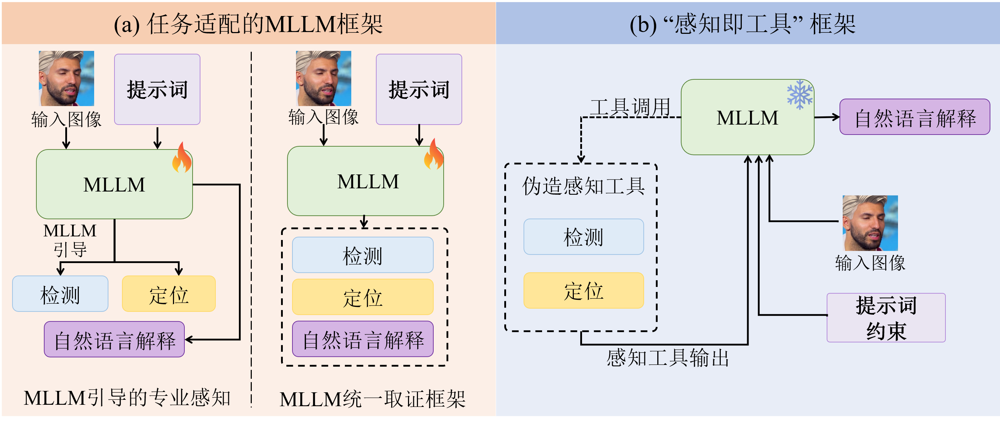
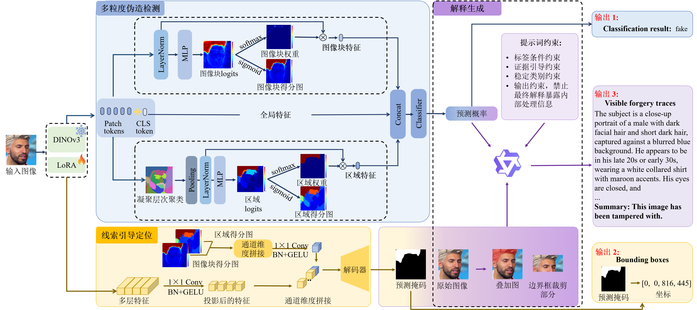

# PATE-Forensics: Perception-as-Tool for Explainable Image Forgery Detection and Localization

A multi-granularity forensic framework for image forgery detection, localization, and explanation.

## Framework



Rather than fine-tuning an MLLM to perform detection, localization, and explanation, the Perception-as-Tool framework decouples specialized forgery perception from natural language generation.

## Method



Built on DINOv3-L/16 with LoRA adaptation, PATE-Forensics jointly models global, patch-level, and region-level evidence and uses localization outputs to guide an MLLM in generating explanations of visible forgery traces.

## Environment

Use Python 3.10. Dependency versions are listed in [requirements.txt](requirements.txt).

```bash
conda create -n ddl python=3.10 -y
conda activate ddl
pip install -r requirements.txt
```

## Data Preparation

Datasets are not distributed with this repository. Prepare them separately and place them in the following directories:

```text
datasets/
├── phase1/track1_inner/track1/
│   ├── train/
│   └── valid/
├── phase2/track1/test/
├── DDL_X_test/image/
├── OpenSDI/
└── SynthScars/
```

See the [dataset directory layouts](datasets/README.md) for the OpenSDI Parquet shards and the SynthScars image and annotation directories.

## Training

Prepare the backbone weights listed below before training, and adjust the configurations in `cfgs/train/` to match your GPU count and available memory. By default, SynthScars training also requires the DDL-X checkpoint to initialize the classification module.

```bash
# DDL-X
python train.py --cfg cfgs/train/gps_dino_mask_mixed_phase1_phase2_wo_maskloss.yaml --logdir ddl_x

# OpenSDI (4 GPUs by default)
bash opensdi_train/train.sh

# SynthScars
bash synthscars_train/train.sh
```

Training logs and checkpoints are saved to `logs/ddl_x/`, `logs/opensdi/`, and `logs/synthscars/`, respectively.

## Evaluation

The DINOv3 backbone is `facebook/dinov3-vitl16-pretrain-lvd1689m`, available from [ModelScope](https://www.modelscope.cn/models/facebook/dinov3-vitl16-pretrain-lvd1689m).

### DDL-X

Download the trained checkpoint from [Google Drive](https://drive.google.com/file/d/12xMXHFRo6fcOEh0vfw2yhyM5RD53nbYY/view?usp=sharing) and arrange the weights as follows:

```text
weights/
├── dinov3-l16/       # DINOv3 backbone configuration and weights
├── model_best.ckpt   # DDL-X checkpoint
```

```bash
# Run detection and localization to generate submission files
bash infer_submission.sh

# Optional: generate explanations; configure the API in the script first
bash update_submission_new.sh
```

By default, these scripts use `datasets/DDL_X_test/image/` and `weights/model_best.ckpt`, with outputs saved to `outputs/test/`. They generate predictions and submission files rather than directly computing official evaluation scores. Explanation generation calls an external MLLM API.

### OpenSDI

```bash
bash opensdi_test/test.sh logs/opensdi/last.ckpt outputs/opensdi
```

Evaluation covers five generators and reports detection F1 and accuracy, along with localization IoU and F1.

### SynthScars

```bash
bash synthscars_test/test.sh logs/synthscars/last.ckpt outputs/synthscars_test
```

Evaluation reports foreground/background mIoU and foreground F1.

After localization, generate and score explanations:

```bash
# Set DASHSCOPE_API_KEY in your environment (do not commit API credentials).
bash synthscars_test/explain.sh
bash synthscars_test/score_explanations.sh
```

Generation uses Qwen3.5-Flash with temperature 0 and a 500-token response limit.
The API receives the original image followed by up to four crops from predicted-mask
components, then the fixed prompt; no mask, overlay, predicted label, or reference
caption is sent. Eight-connected components smaller than 8 pixels are discarded;
the four largest are kept without merging. Each box is padded on each side by
`max(8, side // 3)` pixels and clipped to the image. Crops with a side at most 10
pixels are skipped; smaller remaining crops are enlarged with Lanczos to a minimum
side of 128 pixels. JSON responses are deterministically rendered into explanations.
Completed samples are retained for resume. API requests may incur charges.

Scoring uses the top-level reference caption, whitespace-token ROUGE-L F1 and cosine
similarity from `sentence-transformers/paraphrase-MiniLM-L6-v2`, both scaled by 100.
The CSS encoder is downloaded on first use, or set `CSS_MODEL` to a local copy under
`weights/`. Re-running the external API or using different localization masks may
change the scores.

## Main Results

The following PATE-Forensics results are reported in the paper, not obtained from runtime smoke tests. Values retain the scales used in the paper.

### DDL-X

Official evaluation scores.

| Method | Overall Score ↑ | Weighted ACC Score ↑ | Weighted IoU Score ↑ | Weighted BERTScore ↑ | Weighted Rub. Score ↑ |
|---|---:|---:|---:|---:|---:|
| PATE-Forensics | **0.8940** | **0.1995** | **0.3079** | **0.0943** | **0.2923** |

### OpenSDI

The model is trained only on the SD1.5 training set. Detection and localization results are shown below; AVG is the arithmetic mean across the five generators.

| Test Generator | Detection F1 ↑ | Detection ACC ↑ | Localization IoU ↑ | Localization F1 ↑ |
|---|---:|---:|---:|---:|
| SD 1.5 | 0.9774 | 0.9772 | 0.7829 | 0.8587 |
| SD 2.1 | 0.9715 | 0.9720 | 0.7376 | 0.8199 |
| SDXL | 0.9393 | 0.9418 | 0.5852 | 0.6786 |
| SD 3 | 0.8519 | 0.8694 | 0.6546 | 0.7502 |
| Flux.1 | 0.3291 | 0.5939 | 0.1958 | 0.2630 |
| **AVG** | **0.8138** | **0.8709** | **0.5912** | **0.6741** |

### SynthScars

Localization and explanation results are shown below. The explanation MLLM is not fine-tuned for the task.

| Method | Localization mIoU ↑ | Localization F1 ↑ | ROUGE-L ↑ | CSS ↑ |
|---|---:|---:|---:|---:|
| PATE-Forensics | **60.92** | **46.76** | **35.11** | **69.75** |
